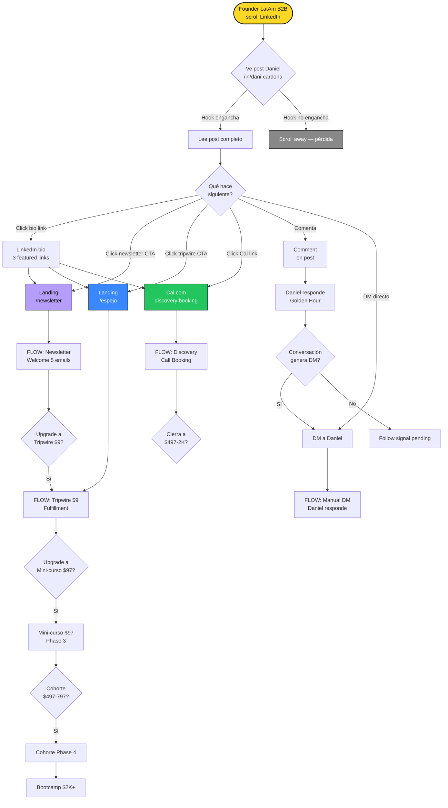
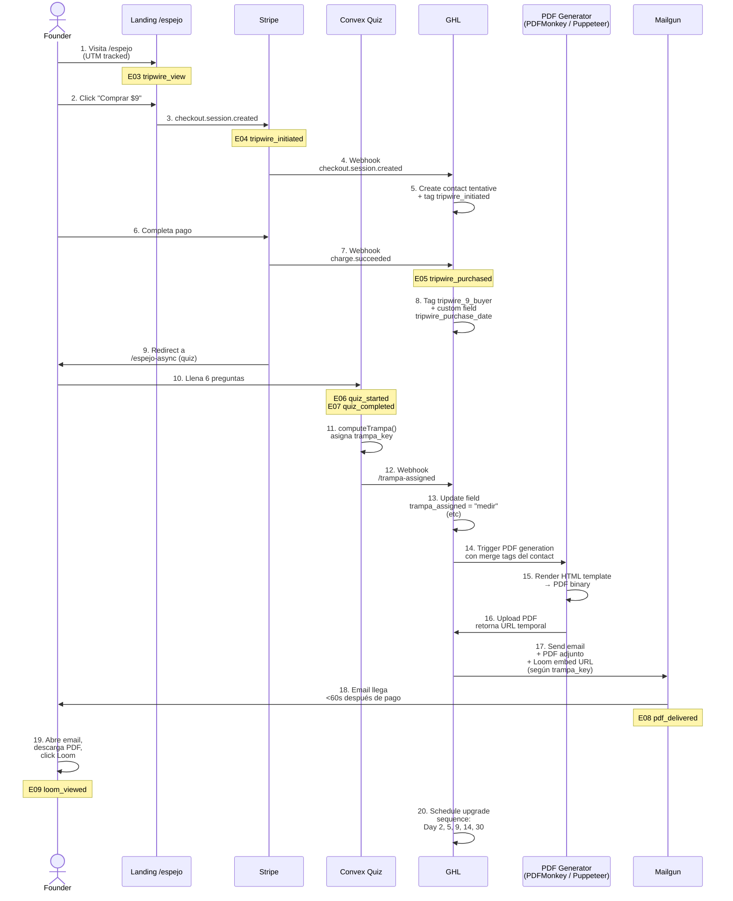
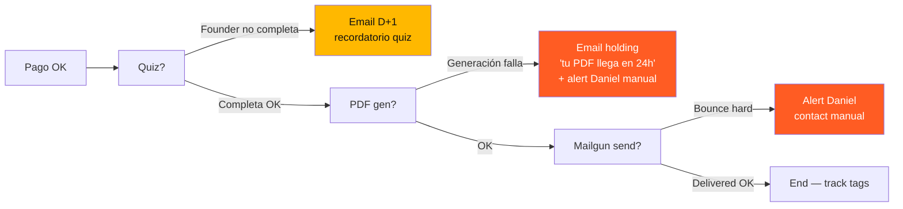
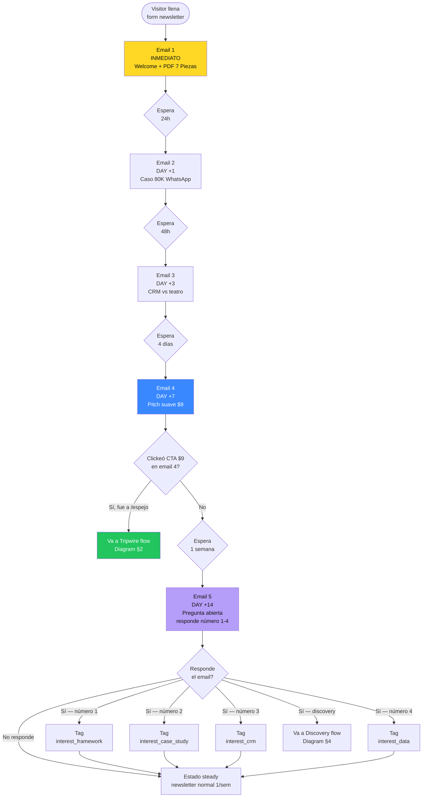
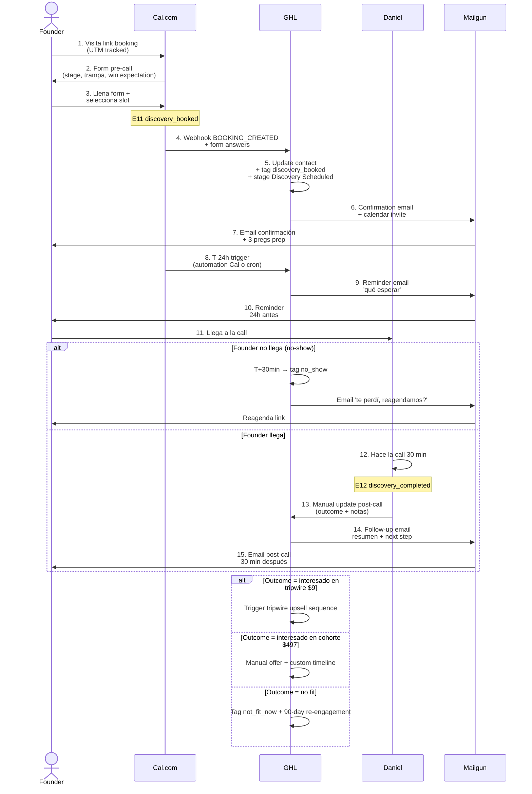
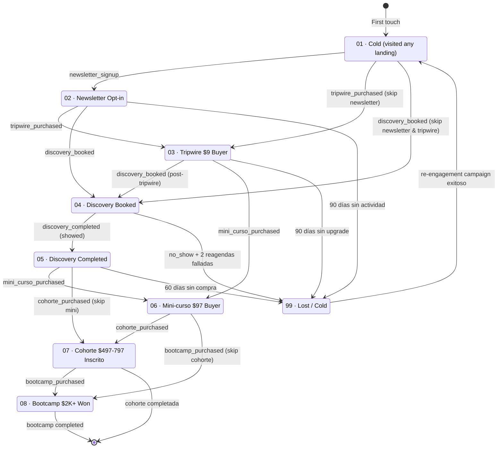
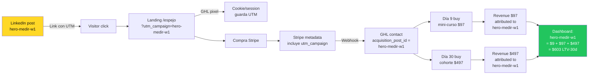

# System Flow Diagrams · BPMN-Style (Mermaid)

**Para:** Daniel + GHL Implementer
**Uso:** Daniel aprueba → implementer construye. Si Daniel ve algo mal en cualquier diagrama, comenta inline y volvemos a aprobar antes de construir.

**Render:** todos los diagramas son Mermaid — se ven correctamente en GitHub, VSCode, Notion, Obsidian, y cualquier markdown viewer moderno.

---

## ÍNDICE

1. [Master Funnel — vista alto nivel](#1-master-funnel)
2. [Tripwire $9 Fulfillment — detalle técnico](#2-tripwire-9-fulfillment)
3. [Newsletter Welcome Series — 5 emails](#3-newsletter-welcome-series)
4. [Discovery Call Flow](#4-discovery-call-flow)
5. [Pipeline ESCALA Ladder — state transitions](#5-pipeline-state-transitions)
6. [Attribution Model — cómo se ata revenue a post_id](#6-attribution-model)

---

## 1. Master Funnel {#1-master-funnel}

Vista alto nivel de las 4 entry paths + sus destinos.



### Decisiones pendientes en este diagrama

- [ ] ¿Qué pasa con "Comment" que NO genera DM? Daniel: ¿dejas signal en GHL para futuro retargeting o lo dejas pasar?
- [ ] ¿Qué pasa con visitor que SOLO ve bio sin click? Sin tracking visible — aceptamos pérdida.

---

## 2. Tripwire $9 Fulfillment {#2-tripwire-9-fulfillment}

Sequence diagram detallado del flujo más complejo: $9 → PDF + Loom en <60s.



### Decisiones pendientes en este diagrama

- [ ] **Step 11 — Quiz**: ¿el quiz vive en mismo deployment Convex `superb-whale-436` que la versión live (bootcamp), o se crea uno nuevo `async-superb-whale`? **Recomendación:** mismo deployment, nuevo `sessionCode = "ASYNC2026"` para no mezclar data con bootcamp.
- [ ] **Step 15 — PDF stack**: Daniel decide Puppeteer self-host vs PDFMonkey ($29/mo) vs Documint ($24/mo). Implementer recomienda PDFMonkey.
- [ ] **Step 17 — Email template**: ¿adjunto + hosted backup link, o solo hosted link (más liviano email)? **Recomendación:** ambos. Adjunto + hosted link en cuerpo, por si client no abre adjuntos.
- [ ] **Step 20 — Upgrade sequence**: copy específico día 2, 5, 9, 14, 30 — Daniel aprueba en sesión separada Phase 2.

### Error states (qué pasa si algo falla)



---

## 3. Newsletter Welcome Series {#3-newsletter-welcome-series}

5 emails con triggers temporales + branch logic.



### Stop conditions (cuándo PARA la secuencia)

- Si compra tripwire $9 en cualquier momento → mueve a secuencia upgrade tripwire, PARA welcome
- Si bookea discovery en cualquier momento → mueve a discovery flow, PARA welcome
- Si unsubscribe → PARA permanente
- Si bounce hard → tag `email_invalid`, PARA permanente

### Decisiones pendientes

- [ ] ¿El PDF "7 Piezas" del Email 1 ya existe? Si no, hay que crearlo (~2h Daniel) — **NO BLOQUEA go-live**, se puede swap link el martes
- [ ] ¿El "Caso 80K WhatsApp" del Email 2 es real o ficción? Si real, necesitamos permiso founder

---

## 4. Discovery Call Flow {#4-discovery-call-flow}



### Decisiones pendientes

- [ ] **Cal.com booking form fields**: confirmar las 3 preguntas en `04-content-production/content-week1-launch-pack.md` §12 son las definitivas
- [ ] **Calendar slots**: martes/jueves 4-6pm COT — ¿OK?
- [ ] **Daniel post-call update manual**: si Daniel no hace el update post-call, no hay E12. ¿Aceptable o necesitamos automation que pregunte "¿cómo fue la call?" T+1h?

---

## 5. Pipeline ESCALA Ladder — State Transitions {#5-pipeline-state-transitions}

Pipeline único con 8 stages. Un contact siempre está en exactamente 1 stage.



### Regla clave

Un contact SOLO sube de stage, nunca baja (excepto a Lost). Si compra tripwire $9 antes de ser newsletter signup → salta directo a S03.

### Decisiones pendientes

- [ ] **¿Lost timing?** 90 días para newsletter sin actividad. ¿OK o más agresivo (60d) / menos (180d)?
- [ ] **¿Re-engagement campaign desde Lost?** Definir en Phase 2-3, no urgente

---

## 6. Attribution Model {#6-attribution-model}

Cómo se ata cada compra (revenue) al post de LinkedIn que originó el lead.



### Reglas de atribución

- **First-touch attribution**: el `acquisition_post_id` se setea en el primer touch (newsletter signup o tripwire compra) y NO cambia después. Aunque después el founder vea más posts, todo revenue se atribuye al post original.
- **Excepción**: si el founder hace newsletter signup desde post A y luego compra tripwire desde post B (separado de email newsletter), atribuimos a post B (segundo touch genera la conversión). Esto requiere lógica especial — definir Phase 2 si vale la pena.
- **Multi-touch (Phase 3+)**: si tenemos 100+ contacts/mes, vale la pena modelo multi-touch. Hoy first-touch es suficiente.

### Decisiones pendientes

- [ ] ¿First-touch o last-touch? **Recomendación: first-touch** Phase 1-2, switch a multi-touch Phase 3+
- [ ] ¿Cómo manejamos posts repurposeados (mismo contenido LinkedIn vs TikTok)? **Recomendación:** UTM campaign suffix `-li` o `-tt` para distinguir plataforma

---

## Cómo usar este doc en la review

**Daniel:** lee los 6 diagramas en orden. En cada uno, sección "Decisiones pendientes" requiere tu input. Marca con ✅ las que apruebas, ✏️ las que cambias.

**Implementer:** no construye nada hasta que Daniel marque ✅ en TODAS las decisiones pendientes. Si Daniel cambia algo (✏️), actualiza el diagrama acá y vuelves a pedir aprobación.

**Versión de este doc:** v1 · 2026-05-22

Cambios versión a versión van al final del archivo:

```
## Changelog
- v1 (2026-05-22): Initial version
```
